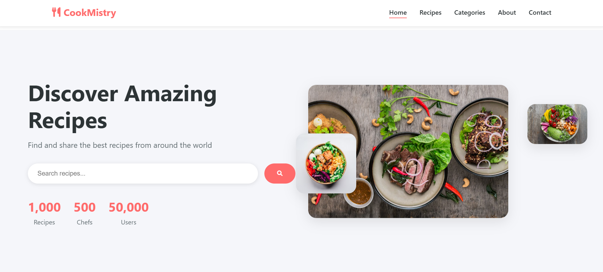
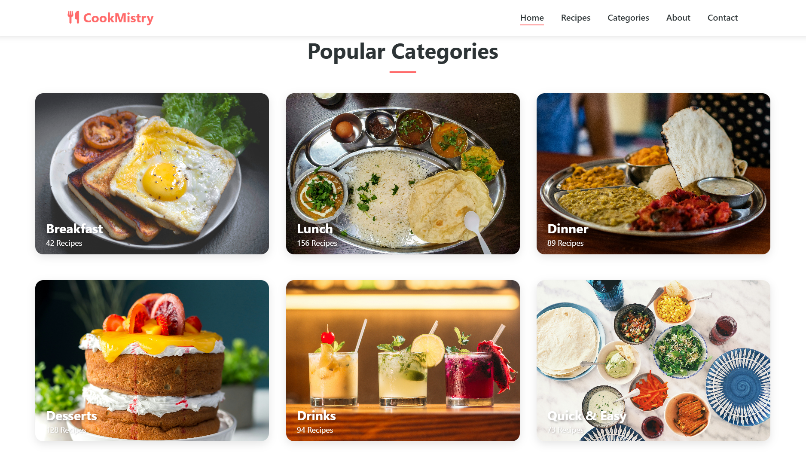

# CookMistry - Recipe Discovery Platform

CookMistry is a modern, responsive web application for discovering and exploring food recipes from around the world. The platform integrates with the Spoonacular API to provide users with a rich collection of recipes, nutrition information, and cooking instructions.

## Screenshots


*CookMistry homepage with featured recipes*


*Example of a recipe detail page on CookMistry*

## Features

- **Recipe Search**: Find recipes by name, ingredients, or cuisine
- **Featured Recipes**: Discover curated collections of popular recipes
- **Detailed Recipe Information**: Get comprehensive cooking instructions, ingredients list, nutrition facts, and difficulty ratings
- **Recipe Categories**: Browse recipes by meal type (Breakfast, Lunch, Dinner, etc.)
- **Responsive Design**: Fully functional across desktop, tablet, and mobile devices
- **Interactive UI**: Engaging animations and modern user interface
- **Newsletter Subscription**: Stay updated with the latest recipes and cooking tips
- **Dark/Light Theme Toggle**: Switch between light and dark themes for comfortable viewing

## Technology Stack

- **Frontend**: HTML5, CSS3, JavaScript (ES6+)
- **API Integration**: Spoonacular API for recipe data
- **Animations**: AOS (Animate on Scroll) library
- **Icons**: Font Awesome
- **Performance Optimizations**: Lazy loading, efficient DOM manipulation

## Project Structure

```
CookMistry/
├── index.html        # Main entry point of the application
├── style.css         # Main stylesheet
├── script.js         # Main JavaScript file with application logic
├── config.js         # Configuration file for API keys and settings
├── pages/            # Category-specific pages
│   ├── Breakfast/
│   ├── Lunch/
│   ├── Dinner/
│   ├── Desserts/
│   ├── Drinks/
│   └── Quick & Easy/
└── README.md         # Project documentation
```

## Getting Started

1. Clone the repository
2. Open `index.html` in your browser to view the application
3. To enable API functionality, replace the API key in `config.js` with your own [Spoonacular API](https://spoonacular.com/food-api) key

## Key Features in Detail

### Recipe API Integration

The application uses a custom `RecipeAPI` class to handle all API interactions, including:
- Searching for recipes based on user input
- Loading featured recipes
- Fetching detailed recipe information

### Interactive UI Elements

- Animated recipe cards with difficulty ratings
- Modal-based detailed recipe view
- Responsive navigation with hamburger menu for mobile
- Newsletter subscription with visual feedback
- Animated counters for statistics
- Parallax scrolling effects
- Dark/light theme toggle for improved user experience

### Responsive Design

The website is designed to provide an optimal viewing experience across a wide range of devices, from mobile phones to desktop computer monitors.

## License

&copy; 2024 CookMistry. All rights reserved. 

